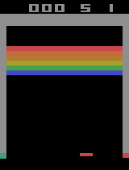
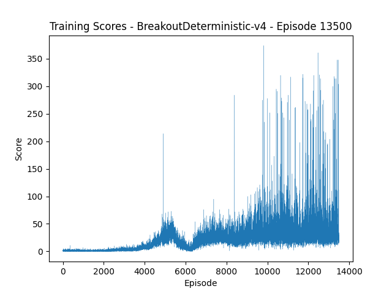

## Breakout

  

    <h3>Episode 13500</h3>
    

      
    

  

  

    <h3>Episode 5000</h3>
    

      
    

  

   

    <h3>Episode 10000</h3>
    

      
    

  

  The following figure shows the total reward the agent achieved for each espisode of training.

